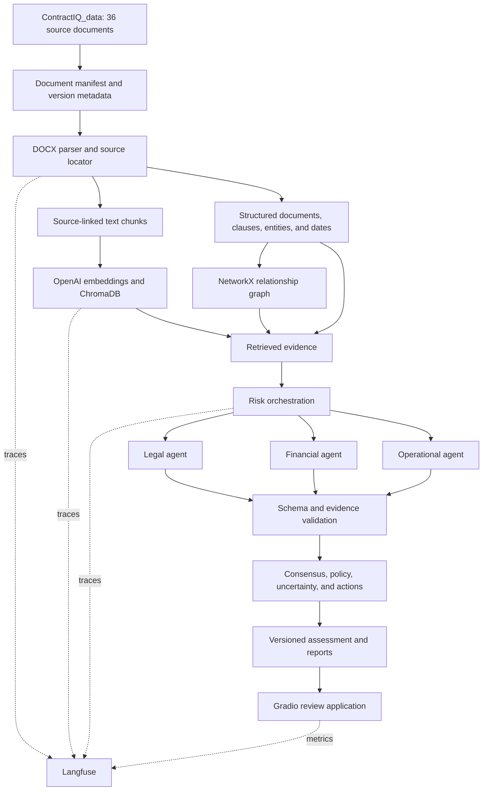

# ContractIQ Project Execution Roadmap

## Purpose

This is the implementation plan for **our ContractIQ project**. It uses the course notebooks as learning references, but it does not copy their incomplete assignment scaffolding or the unrelated Week 8 pricing/catalog hints.

The goal is a real, evidence-backed contract intelligence application that works on the project dataset, runs through a Gradio UI from a notebook, and can later be extracted into a maintainable Python service.

## Required Outcome

The completed system must:

1. Process the 36 project documents across all eight dataset categories.
2. Extract contract text, tables, clauses, entities, dates, monetary amounts, terms, and stable evidence locations.
3. Store source-linked chunks in ChromaDB and retrieve evidence through semantic search.
4. Run legal, financial, and operational risk assessments with structured Pydantic results.
5. Combine specialist results while preserving failures, uncertainty, disagreements, and source evidence.
6. Build a verified NetworkX relationship graph across contracts, clauses, risks, and mitigations.
7. Trace workflow behavior, latency, token usage, errors, and evaluation scores in Langfuse.
8. Provide a Gradio UI with **Upload**, **Risk Analysis**, **Knowledge Graph**, and **Reports** tabs.
9. Generate source-linked findings, human-review-ready recommendations, and downloadable reports.

## Guiding Rules

- Start with one representative real DOCX before indexing or analyzing the complete corpus.
- Retain the source reference from parsing through every finding and report.
- Keep original documents separate from parsed artifacts, ChromaDB indexes, and generated findings.
- Treat missing evidence as `unknown` or `insufficient_evidence`; never invent clauses, page numbers, dates, or values.
- Use the existing HTML prototype as a UX reference only. It currently contains sample data and local browser behavior, not the target AI backend.
- Keep notebooks focused on learning, testing, and demonstration. Move validated code into reusable Python modules before application integration.
- A valid Pydantic object is structurally correct, not automatically factually or legally correct. Validate the cited evidence separately.
- Human review is mandatory for legal, financial, and negotiation decisions.

## Target Architecture



## Proposed Project Layout

Create this structure gradually as phases are validated:

```text
PWC_CONTRACTIQ_PROJECT/
  ContractIQ_data/                 # Existing original data; do not modify
  Research/
    00_Project_Setup.ipynb
    01_Data_Manifest_and_Parsing.ipynb
    02_Entity_Clause_and_EDA.ipynb
    03_Retrieval_and_ChromaDB.ipynb
    04_Legal_Risk_Agent.ipynb
    05_Multi_Agent_Orchestration.ipynb
    06_Knowledge_Graph.ipynb
    07_Evaluation_and_Observability.ipynb
    08_Gradio_Integration.ipynb
    ContractIQ_Project_Execution_Roadmap.md
  src/contractiq/
    config.py
    models.py
    ingestion.py
    extraction.py
    retrieval.py
    agents.py
    orchestration.py
    graph.py
    evaluation.py
    reporting.py
    app_service.py
  artifacts/
    manifests/
    parsed_documents/
    evaluations/
    reports/
  chroma_contracts_db/
  tests/
```

`src/contractiq` is the target location for code that has passed notebook checks. The notebooks remain the learning path and executable demonstrations.

## Phase 0: Define Contracts and Prepare the Environment

**Notebook:** `00_Project_Setup.ipynb`

1. Select and verify the Python interpreter.
2. Create a `.env` file outside version control with OpenAI and Langfuse credentials.
3. Install pinned dependencies: `python-docx`, OpenAI SDK, LangChain/LCEL, Pydantic v2, ChromaDB, NetworkX, PyVis, Langfuse, Gradio, Pandas, Matplotlib, and test tooling.
4. Define configuration for project root, data root, artifacts, ChromaDB persistence, model names, chunk settings, and Langfuse project/session values.
5. Initialize Langfuse and create a safe traced embedding and completion wrapper.
6. Define shared Pydantic records: `DocumentRecord`, `SourceLocation`, `Entity`, `Chunk`, `Finding`, `Assessment`, and `GraphEdge`.
7. Create the exact eight-category taxonomy and separate agreements from supporting documents.
8. Scan the dataset and generate a manifest containing a stable ID, category, path, file size, content hash, parse status, and document role.

**Completion gate:** The manifest accounts for 36 expected documents, a synthetic LLM call is traced, secrets are not printed, and a restarted notebook can reproduce the manifest.

## Phase 1: Parse Documents and Preserve Evidence

**Notebook:** `01_Data_Manifest_and_Parsing.ipynb`

1. Select one representative MSA and one table-heavy supporting document for initial validation.
2. Parse DOCX paragraphs and tables using `python-docx`.
3. Retain a stable location for every extract, such as `paragraph:14` or `table:2,row:4,cell:3`.
4. Detect candidate headings, section numbers, articles, schedules, exhibits, and appendices.
5. Build clause records that contain heading, clause text, source locations, and document/version identity.
6. Handle malformed, empty, and unsupported documents without failing the whole batch.
7. Save parsed JSON artifacts outside the original dataset directory.
8. Run the parser across the full document manifest only after the initial documents are manually verified.

**Completion gate:** Every extracted example can be located in the original document; tables preserve meaningful values; failures are recorded per file; no source document is changed.

## Phase 2: Extract Entities, Normalize Terms, and Analyze the Corpus

**Notebook:** `02_Entity_Clause_and_EDA.ipynb`

1. Extract parties, dates, monetary amounts, percentages, currencies, durations, notice periods, payment terms, renewal language, liability terms, termination language, SLA terms, confidentiality, indemnification, and IP terms.
2. Store both raw extracted text and normalized values with their `SourceLocation` references.
3. Keep semantic distinctions separate: effective date, expiry date, renewal date, notice deadline, invoice amount, and agreement value are not interchangeable.
4. Add rule-based risk indicators as preliminary signals, not final legal conclusions.
5. Create corpus EDA: category counts, document lengths, parse success rate, table counts, section counts, missing fields, and entity distribution.
6. Save visualizations and a data-quality report to `artifacts/`.
7. Produce a small human-reviewed extraction sample that becomes the first evaluation fixture.

**Completion gate:** Extracted entities resolve back to exact source text, ambiguous fields remain unresolved rather than guessed, and the batch report explains all parse/extraction failures.

## Phase 3: Build Evaluated Semantic Retrieval

**Notebook:** `03_Retrieval_and_ChromaDB.ipynb`

1. Design source-aware chunks that preserve clause boundaries where possible.
2. Start with 600-800 word chunks and 80-120 word overlap, then compare retrieval quality instead of assuming those values are optimal.
3. Add chunk IDs, document/version ID, category, source-location range, and text hash.
4. Generate `text-embedding-3-small` embeddings through traced wrapper functions.
5. Store chunks and metadata in a persistent ChromaDB collection using cosine distance.
6. Implement idempotent indexing so unchanged content does not create duplicate chunks.
7. Implement search returning the text, score, document metadata, and source locations.
8. Add metadata filters for document ID, category, and document role.
9. Create 10-15 test questions with manually identified evidence passages, including liability, payment, termination, SLA, and confidentiality questions.

**Completion gate:** The persisted index reloads after restart; filtered retrieval respects scope; returned passages have resolvable provenance; retrieval quality is measured against labeled examples.

## Phase 4: Create One Evidence-Grounded Legal Agent

**Notebook:** `04_Legal_Risk_Agent.ipynb`

1. Define the legal-assessment schema before prompt development.
2. Require each legal finding to contain severity, title, rationale, recommendation, evidence IDs, evidence excerpts, verification status, and `insufficient_evidence` behavior.
3. Retrieve relevant clause evidence before invoking the agent; do not ask the model to cite nonexistent locations.
4. Build a LangChain LCEL chain using a legal-review system prompt, retrieved evidence, policy context, ChatOpenAI, and Pydantic output parsing.
5. Validate the structured output against allowed severity values and evidence IDs.
6. Validate that cited excerpts are actually present in retrieved or parsed source text.
7. Test normal, incomplete, adversarial document-instruction, and malformed-model-output cases.

**Completion gate:** A legal finding for a real contract is structured, source-backed, reviewable, and explicitly uncertain where evidence is insufficient.

## Phase 5: Add Financial and Operational Specialists, Then Orchestrate

**Notebook:** `05_Multi_Agent_Orchestration.ipynb`

1. Implement the financial specialist for payment terms, financial exposure, penalties, pricing, escalation, and renewal comparisons.
2. Implement the operational specialist for scope, deliverables, acceptance criteria, SLAs, dependencies, performance metrics, and remedies.
3. Reuse the legal agent's source-evidence and validation conventions for all specialists.
4. Build a sequential orchestrator first, so individual failures and result contracts are easy to debug.
5. Add bounded retries for transient service errors and capture retry information in traces.
6. Add concurrent execution only after the sequential workflow is correct.
7. Preserve each specialist's success, failure, incomplete, and validation status.
8. Build consensus by merging evidence-backed findings, preserving disagreements, and deduplicating only genuinely equivalent findings.
9. Apply a documented risk policy: LOW = 1, MEDIUM = 2, HIGH = 3, CRITICAL = 4; use legal 40%, financial 35%, and operational 25% only as an explainable summary, never to hide a Critical risk.
10. Produce an assessment containing dimension results, citations, unresolved issues, consensus actions, and overall risk.

**Completion gate:** One real agreement completes all three assessments; one simulated agent failure yields a clear partial result; a Critical finding remains visible regardless of average score.

## Phase 6: Add Verified Contract Relationships

**Notebook:** `06_Knowledge_Graph.ipynb`

1. Define node types: document, contract type, party, clause, risk, mitigation, obligation, and category.
2. Define relationship types: `GOVERNS`, `AMENDS`, `RENEWS`, `REFERENCES`, `BELONGS_TO`, `CONTAINS`, `ADDRESSES`, and `MITIGATES`.
3. Start with one manually verified document family, such as an MSA and its related SOW or renewal.
4. Store evidence and verification status on every edge.
5. Implement queries for related agreements, source clauses, risk mitigations, renewal/dependency chains, and missing protections.
6. Render static NetworkX and interactive PyVis visualizations.
7. Avoid deriving contractual relationships from filename similarity alone.

**Completion gate:** Every graph edge in the first document family is backed by source evidence and directionally correct; queries return evidence references as well as graph labels.

## Phase 7: Evaluation, Monitoring, and Reports

**Notebook:** `07_Evaluation_and_Observability.ipynb`

1. Freeze a reviewed evaluation set spanning extraction, retrieval, legal, financial, and operational workflows.
2. Measure parse success, entity accuracy, retrieval relevance, citation validity, finding support, important missed-risk rate, schema failures, and partial-run frequency.
3. Track latency, retries, token usage, and cost separately for embeddings, retrieval, and each specialist agent.
4. Attach document version, model version, prompt version, policy version, and run ID to every trace and report.
5. Add Langfuse scores for reviewer-assessed citation validity and finding quality; do not use the model's confidence as the only quality signal.
6. Generate a report with findings, evidence, uncertainty, recommendations, specialist statuses, and date/version information.
7. Add focused unit tests for source mapping, entity normalization, index idempotency, and consensus behavior.

**Completion gate:** A poor result can be traced to a concrete stage; metrics have clear definitions; every report is evidence-linked and versioned.

## Phase 8: Gradio Application Integration

**Notebook:** `08_Gradio_Integration.ipynb`

This notebook is the first complete user-facing implementation. It imports reusable code from `src/contractiq` and must not depend on hidden execution order from earlier notebooks.

### Gradio Tab 1: Upload

1. Upload DOCX files, select or infer document category, and validate file type/size.
2. Display parse status, extracted metadata, document ID, and any warnings.
3. Let the reviewer inspect extracted paragraphs/tables and source locations before indexing.
4. Persist parsed artifacts and provide an explicit index action.

### Gradio Tab 2: Risk Analysis

1. Select an indexed agreement or upload contract text for a temporary review.
2. Run the orchestrator and show overall risk, per-dimension status, findings, evidence excerpts, recommendations, and unresolved issues.
3. Provide source links or selectors that navigate directly to the cited paragraph/table record.
4. Clearly label partial analysis, no-evidence responses, model/validation failures, and human-review-required outputs.
5. Allow JSON and Markdown/PDF-style report download after analysis.

### Gradio Tab 3: Knowledge Graph

1. Select document family, risk, clause, or party.
2. Render the interactive relationship visualization.
3. Show the selected node/edge metadata, evidence, and verification status.
4. Provide graph queries for mitigations, dependencies, related documents, and source clauses.

### Gradio Tab 4: Reports

1. Browse completed assessment runs and their timestamps/versions.
2. Filter by document, category, risk severity, specialist, and status.
3. Download evidence-backed reports and evaluation summaries.
4. Show operational metrics, trace links/identifiers where appropriate, and known limitations.

**Completion gate:** A clean notebook/kernel can start the UI, process a real document, retrieve evidence, run risk analysis, inspect citations and graph links, and download a report.

## Phase 9: Production Hardening and API Adapter

Do this only after the Gradio workflow is reliable.

1. Move configuration into environment variables and validated settings.
2. Add durable storage for document metadata, assessments, reviews, and reports; ChromaDB remains an index, not the sole system of record.
3. Add FastAPI endpoints for health, ingest, search, analysis, graph queries, and reports.
4. Add authentication, authorization, sensitive-data handling, retention policy, rate limits, audit controls, and operational logging.
5. Connect the existing HTML UI only through this tested API contract, replacing its sample risk findings progressively.
6. Add containerization, deployment automation, and cloud hosting after local security and integration tests pass.

**Completion gate:** The application starts from documented configuration, protects credentials, handles invalid input, preserves artifacts across restarts, and passes end-to-end tests without notebook state.

## Implementation Sequence

| Order | Notebook | First tangible result |
|---:|---|---|
| 1 | `00_Project_Setup.ipynb` | Verified environment, manifest, and traced smoke test |
| 2 | `01_Data_Manifest_and_Parsing.ipynb` | One real DOCX parsed with stable evidence locations |
| 3 | `02_Entity_Clause_and_EDA.ipynb` | Source-backed entities and a corpus quality report |
| 4 | `03_Retrieval_and_ChromaDB.ipynb` | Persistent semantic retrieval with evaluated questions |
| 5 | `04_Legal_Risk_Agent.ipynb` | One validated legal assessment |
| 6 | `05_Multi_Agent_Orchestration.ipynb` | Three specialists and explicit consensus |
| 7 | `06_Knowledge_Graph.ipynb` | Evidence-backed related-document graph |
| 8 | `07_Evaluation_and_Observability.ipynb` | Quality metrics, Langfuse scores, and reports |
| 9 | `08_Gradio_Integration.ipynb` | Complete tab-based ContractIQ application |
| 10 | Production modules/API | Restartable, testable deployable system |

## First Build Action

Begin with `00_Project_Setup.ipynb`, but keep its work deliberately small:

1. Confirm the selected interpreter and required package imports.
2. Load credentials only from `.env` or secure notebook secrets.
3. Define the project data path and eight-category taxonomy.
4. Create and save the document manifest.
5. Validate the manifest count and run a minimal Langfuse/OpenAI smoke test.

Do not start full-corpus embeddings, agent calls, or Gradio construction until this foundation is validated.