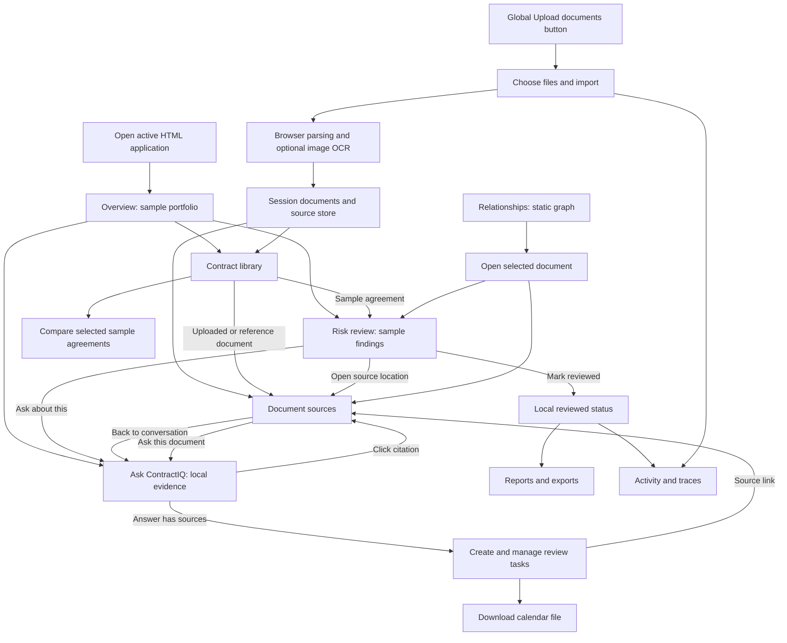
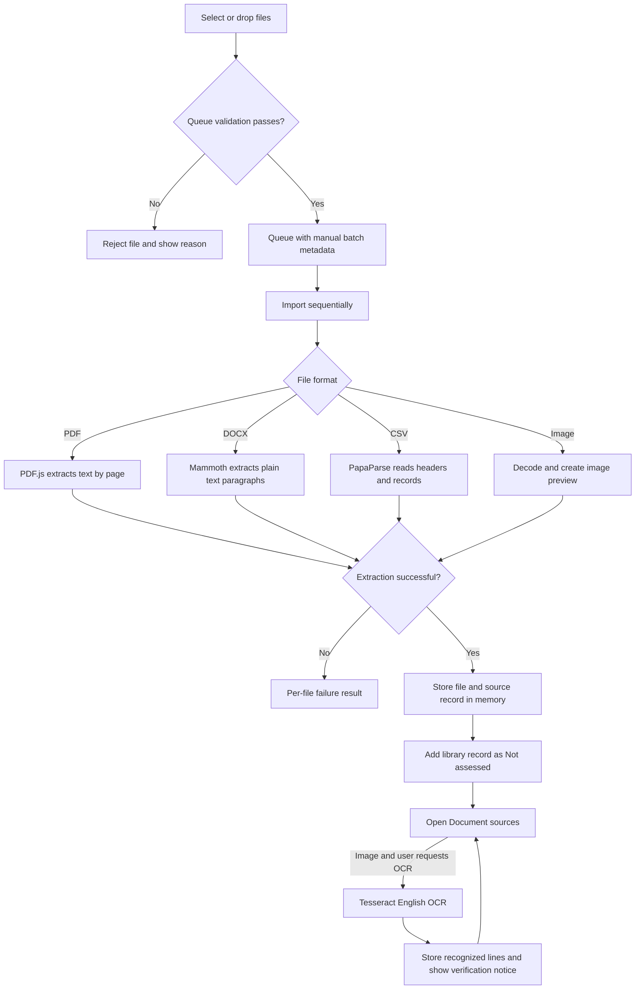
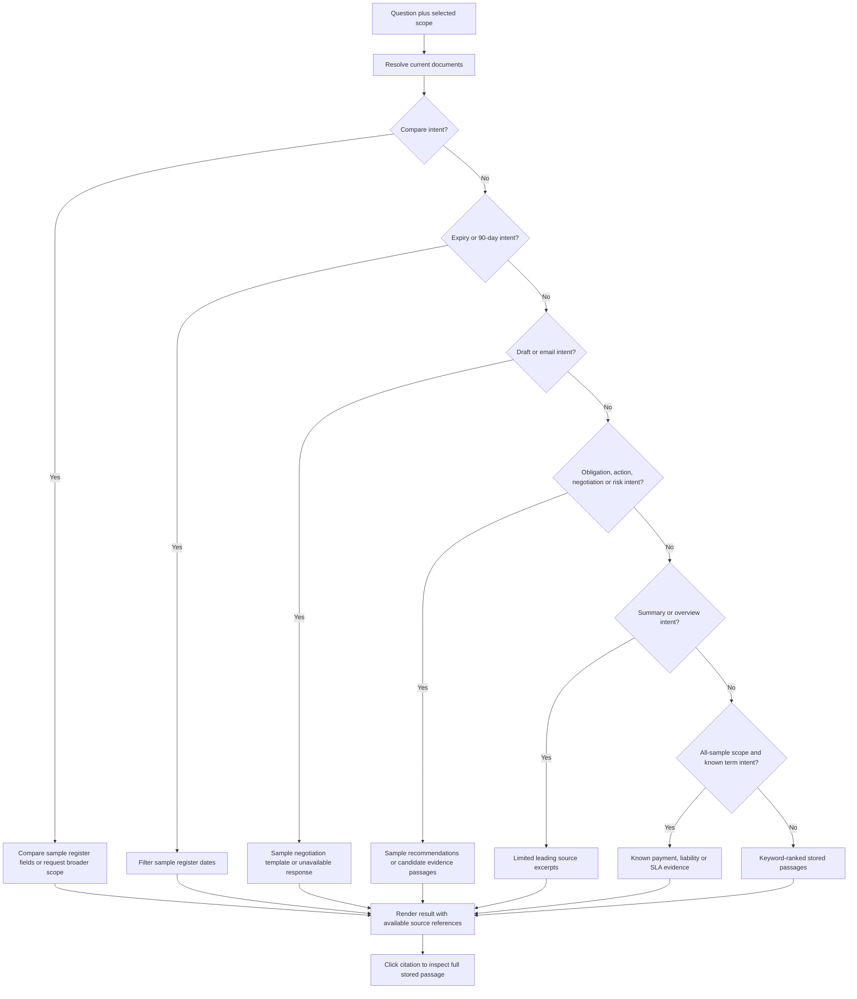
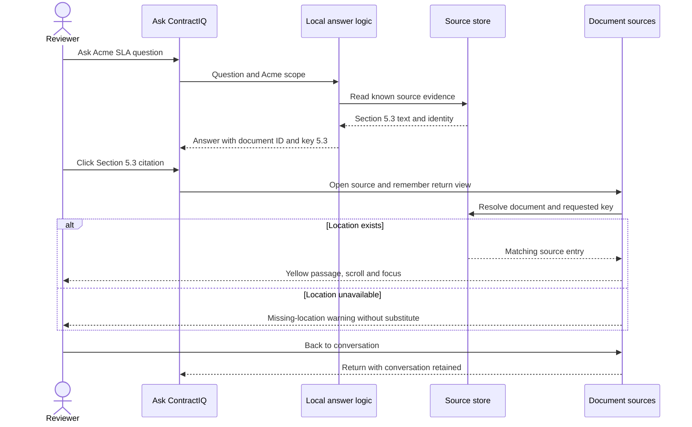
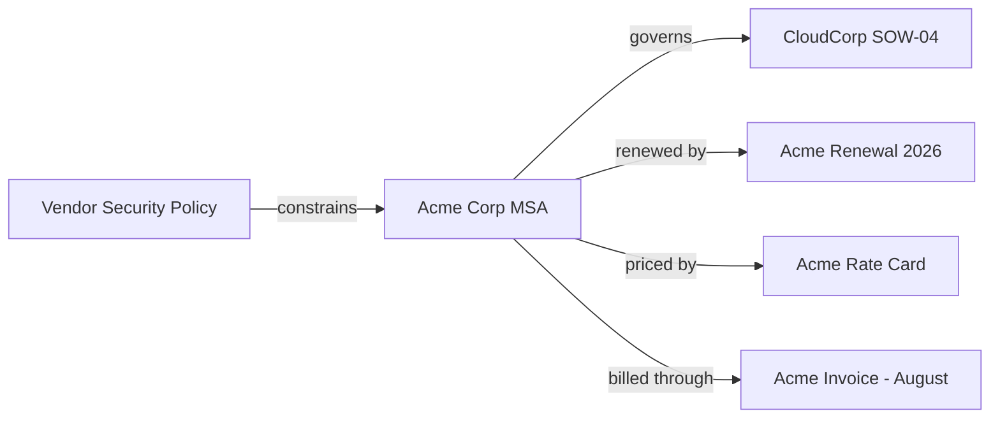
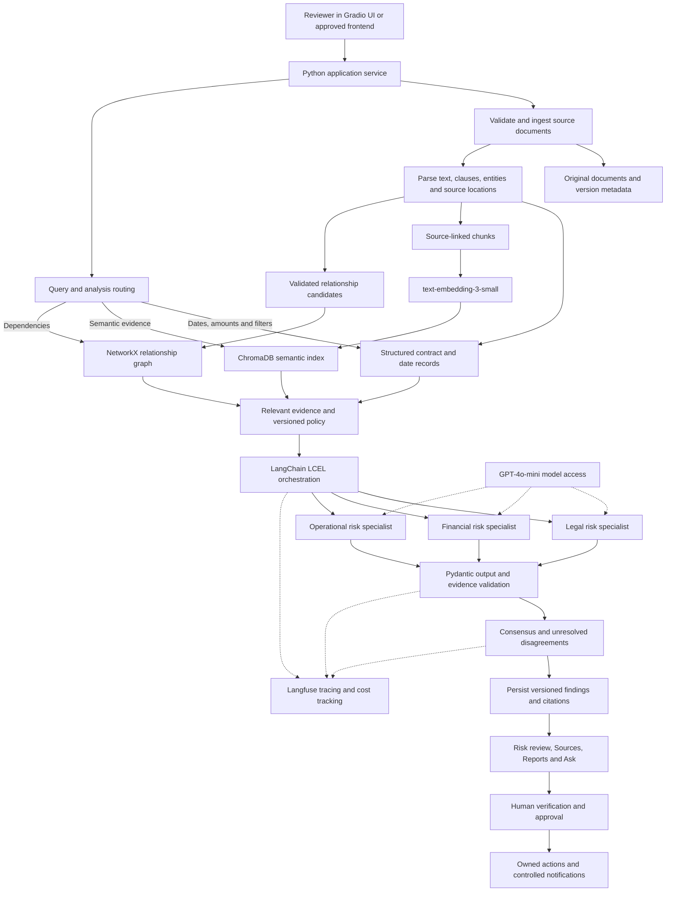

# ContractIQ: Complete Product and UI Guide

> Simple Hinglish guide: business problem se lekar har current UI component, example, evidence flow aur proposed AI backend tak.
>
> Documentation snapshot: 09 September 2026. Active application: [index.html](index.html). Requirements: [original problem statement](../Contract_Intelligence_Detailed_Problem_Statement.docx.pdf).

## Contents

1. [What ContractIQ Solves](#what-contractiq-solves)
2. [What Works Today](#what-works-today)
3. [Documents and Sample Numbers](#documents-and-sample-numbers)
4. [Complete Current UI Flow](#complete-current-ui-flow)
5. [Shared Workspace Components](#shared-workspace-components)
6. [Overview](#overview)
7. [Contract Library](#contract-library)
8. [Upload Documents](#upload-documents)
9. [Risk Review](#risk-review)
10. [Ask ContractIQ](#ask-contractiq)
11. [Document Sources](#document-sources)
12. [Relationships](#relationships)
13. [Review Tasks](#review-tasks)
14. [Reports](#reports)
15. [Activity and Traces](#activity-and-traces)
16. [End-to-End Examples](#end-to-end-examples)
17. [How the Code Works](#how-the-code-works)
18. [Proposed Multi-Agent Architecture](#proposed-multi-agent-architecture)
19. [Requirement Coverage and Roadmap](#requirement-coverage-and-roadmap)
20. [Limitations and Safe Use](#limitations-and-safe-use)
21. [Verification and Demo Checklist](#verification-and-demo-checklist)
22. [Glossary](#glossary)

## What ContractIQ Solves

### Problem Statement in Simple Words

Ek company ke paas MSA, SOW, NDA, invoices, policies, SLA reports aur renewal documents hote hain. Important information alag-alag files mein hoti hai. Sirf documents store karna enough nahi hai: team ko samajhna hai ki **kya commitment hai, kya risk hai, evidence kahan hai, aur next action kya hona chahiye**.

ContractIQ ka target hai documents ko analyze karna, legal/financial/operational risks nikalna, terms compare karna, related documents connect karna aur evidence-backed negotiation recommendations dena. Final decision human reviewer ka rahega.

| Business problem | Simple example | Intended solution | UI surface |
|---|---|---|---|
| Volume overload | 36 documents manually read karne mein time lagta hai | Central register, search, structured extraction and prioritization | Library, Upload, Overview |
| Hidden legal risk | Liability clause mein maximum cap absent hai | Legal specialist with source evidence and policy comparison | Risk review, Sources |
| Hidden financial risk | Net 45 ke saath 2% monthly overdue interest | Financial specialist identifies payment and penalty exposure | Risk review, Ask, Compare |
| Hidden operational risk | Uptime promised hai, lekin remedy missing hai | Operational specialist checks SLA measurement and remedies | Risk review, Sources |
| Fragmented tracking | Renewal date MSA mein, revised price amendment mein | Linked document records, structured dates, actionable tasks | Relationships, Overview, Tasks |
| Inconsistent review | Do reviewers same clause ko different severity dete hain | Versioned policy, specialist findings and explicit consensus | Risk review, Activity |
| Weak traceability | Report risk batata hai, exact clause nahi | Stable source references attached to findings and answers | Sources, Ask, Reports |

**Important:** Table target solution explain karti hai. Current prototype mein sab AI capabilities implemented nahi hain; next section exact boundary batata hai.

### Running Business Example

Fictional Acme agreement ka original annual value USD 480,000 hai. Sample Section 12.1 mein unlimited liability, Section 7.2 mein Net 45 plus 2% monthly overdue interest, aur Section 5.3 mein 99.9% availability without defined service credits hai. Renewal sample USD 520,000 propose karta hai.

Reviewer ke questions honge: liability cap negotiate karein? Finance payment penalty approve kare? Missed uptime par credit milega? USD 40,000 increase ka reason kya hai? Yeh increase approximately 8.33% hai, lekin overlapping agreement values ko portfolio spend ki tarah add nahi karna chahiye.

Yeh **fictional UI sample** hai, kisi actual uploaded Acme contract ka verified assessment nahi.

### Who Uses Which Part

| User | Main decision | Typical path |
|---|---|---|
| Legal reviewer | Liability, confidentiality, indemnity and compliance concerns | Risk review -> Legal -> source -> recommendation |
| Finance reviewer | Payment cycle, penalties and renewal pricing | Ask -> compare terms -> evidence -> task |
| Procurement | Vendor selection and negotiation priorities | Library -> compare -> risk review -> draft |
| Operations owner | Delivery acceptance, SLA and service remedies | Risk review -> Operational -> source |
| Compliance officer | Policy alignment and defensible review trail | Sources -> risk review -> Activity |
| Contract manager | Renewal preparation and ownership | Overview -> expiring library -> Tasks -> Reports |
| Engineer or AI learner | Build the actual capstone pipeline | Code map -> proposed architecture -> roadmap |

These are user personas, **not implemented login roles or access permissions**.

## What Works Today

Use these three labels throughout the guide:

- **Working locally:** Browser mein real interaction or processing hota hai. Data session memory mein rehta hai.
- **Sample/demo:** UI functional hai, lekin underlying contract facts, findings, scores or relationships predefined hain.
- **Planned backend:** Original capstone ka target; active prototype se connected nahi hai.

| Capability | Current reality |
|---|---|
| Nine navigation pages and responsive layout | Working locally |
| Search, filters, sorting and source navigation | Working locally |
| PDF, DOCX and CSV text extraction | Working locally, with limits |
| PNG/JPG/JPEG/WebP image preview and optional English OCR | Working locally; OCR output needs verification |
| Yellow highlight at cited source location | Working locally on extracted text |
| Chat interface | Working locally with keyword search and deterministic templates; no LLM |
| Legal, financial and operational findings | Seven predefined sample findings |
| Agreement scores and policy benchmarks | Illustrative sample values |
| Simulate analysis | Timer and local event; findings do not change |
| Agreement comparison | Predefined fields from five sample agreements |
| Relationship visualization | Six predefined nodes and five predefined edges |
| Tasks, completion, deletion and calendar export | Working locally, human-created tasks |
| CSV, findings JSON, chat JSON and print | Working locally; export content differs by action |
| ChromaDB, embeddings, LangChain, model calls | Not connected |
| NetworkX, Langfuse, durable storage, login or collaboration | Not connected |

**Correct product description:** "An interactive contract intelligence UI prototype with local document extraction, source-linked evidence browsing and review workflows. Multi-agent risk assessment is currently represented by sample data."

The active UI uses HTML/CSS/JavaScript. The problem statement specifies a Python/Gradio implementation. This prototype is a UX reference, not proof that the required Gradio backend is complete. Research notebooks are outside this guide's implementation assessment; their existence does not establish their execution or completeness.

## Documents and Sample Numbers

### Required Dataset

The problem statement describes 36 documents in eight categories. The repository dataset is under [ContractIQ_data](../ContractIQ_data/).

| Dataset category | Count | Why it matters |
|---|---:|---|
| Master Level Agreements | 6 | MSA, NDA and foundational commercial terms |
| Transaction Contracts | 4 | SOWs and renewals for specific work |
| Commercial Documents | 2 | Pricing and commercial conditions |
| Financial and Billing | 4 | Invoices, credits and billing commitments |
| Operational Documents | 4 | Service performance and incident context |
| Compliance Documents | 6 | Security controls and vendor policies |
| Negotiation History | 6 | Earlier positions, redlines and discussions |
| Governance | 4 | Reviews, approvals and renewal context |
| **Total** | **36** | Not automatically loaded into the prototype |

An invoice or policy is a useful supporting document, but not automatically an assessed agreement. Dataset folder taxonomy and UI sample categories are not identical. The sample rate card, for example, is labeled Commercial document in the UI.

### Default UI Records

| Record | Role | Score / severity | Sample expiry |
|---|---|---|---|
| Acme Corp MSA | Assessed agreement | 9.1 / Critical | 12 Oct 2026 |
| CloudCorp SOW-04 | Assessed agreement | 7.8 / High | 28 Nov 2026 |
| TechVendor SLA | Assessed agreement | 7.3 / High | 05 Dec 2026 |
| Global Mutual NDA | Assessed agreement | 3.2 / Low | 19 Jan 2027 |
| Acme Renewal 2026 | Assessed agreement | 5.6 / Medium | 12 Oct 2026 |
| Acme Rate Card | Reference | Not assessed | Not applicable |
| Vendor Security Policy | Reference | Not assessed | Not applicable |
| Acme Invoice - August | Reference | Not assessed | Not applicable |

Default Overview shows **8 documents, 5 assessed agreements, 3 high/critical agreements, 4 renewals in 90 days and 6.6 average score**. Seven findings exist, of which four are High/Critical. The Risk review navigation badge counts those **four findings**, not three agreements.

Dates are calculated against a fixed **09 September 2026** snapshot. They are not calculated against today's live calendar date. Several chart labels and priority items are hardcoded; uploaded documents do not receive new scores or update sample analysis coverage.

## Complete Current UI Flow



All nine views can also be opened directly from the sidebar. The diagram shows useful workflow connections, not a mandatory sequence. Import does **not** trigger AI assessment, and creating a task does **not** send an email.

## Shared Workspace Components

| Component | What it does | Example or boundary |
|---|---|---|
| ContractIQ brand | Navigates to Overview | Return to starting dashboard |
| Workspace identity block | Displays workspace context | Not a workspace switcher |
| WORKSPACE navigation | Overview, Library, Risk review, Ask, Sources | Main document workflows |
| INTELLIGENCE navigation | Relationships, Tasks, Reports, Activity | Supporting analysis workflows |
| Active navigation state | Shows current page | Helps maintain orientation |
| Risk review count badge | Counts High/Critical sample findings | Default 4 |
| Profile: Sam Morgan | Static contract manager identity | No authentication or account settings |
| Sample workspace status | Identifies demonstration state | Not a live service-health monitor |
| Breadcrumb | Displays current section | Workspace -> Document sources |
| Demo data / AI not connected badge | Makes AI status visible | No model API behind current chat |
| Upload documents button | Opens global import dialog | Available without leaving current page |
| Mobile menu button and backdrop | Opens/closes sidebar on narrow screens | Escape also closes menu |
| Dialog close button | Closes an open modal when allowed | Import blocks closing during processing |
| Toast | Brief feedback after actions | Review updated or export prepared |
| Footer | Fixed snapshot and human-review reminder | Not a live clock |
| Accessibility helpers | Skip link, focus styles, labeled icons and reduced motion styles | Do not imply a completed accessibility certification |

This is an in-page application: `state.view` selects the content. It is not a server-routed application with durable document URLs or authenticated sessions.

## Overview

**Problem:** Reviewer ko pehle decide karna hai ki attention kahan dena hai.

**Solution:** A portfolio snapshot with priorities and quick navigation. It summarizes sample records; it does not perform analysis when opened.

| Component | Click behavior or displayed meaning |
|---|---|
| Portfolio overview title and date chip | Fixed sample snapshot |
| Documents metric | Opens Contract library; count includes imported records |
| High-risk agreements metric | Opens Risk review; does not create a high-risk filtered library |
| Renewals in 90 days metric | Opens library with expiry mode enabled |
| Average risk score metric | Opens Reports; default 6.6 across five assessed agreements |
| Needs your attention count | Three predefined priority items |
| Acme unlimited-liability feature | Opens Acme Risk review |
| CloudCorp acceptance row | Opens CloudCorp Risk review |
| TechVendor availability row | Opens TechVendor Risk review |
| Open risk review link | Navigates to review page |
| Risk ring and legend | Sample distribution: 1 Critical, 2 High, 1 Medium, 1 Low; not filter controls |
| Assessment coverage bar | Sample 5/5 agreements, not coverage of the 36-document dataset |
| Legal / Financial / Operational labels | Intended assessment dimensions, not live agent switches |
| Upcoming renewals table | Four sample agreement records; document buttons open review |
| View library link | Opens library, retaining its existing state |
| Ask ContractIQ band | Sets Acme scope and asks the payment-terms question |

**Example:** Contract manager opens Overview, sees Acme as Critical, opens its finding, checks Section 12.1 and decides to request legal review before renewal.

**Boundary:** Reviewing a finding does not reduce the numeric score or remove the hardcoded priority feature. The date chip is not a date-range picker.

## Contract Library

**Problem:** Documents different categories mein scattered hain; relevant contract locate aur compare karna difficult hai.

**Solution:** Searchable register with filters and document-aware navigation.

| Component | Behavior | Example |
|---|---|---|
| All documents tab | Disables expiry-only mode; other filters remain | View agreements and reference records |
| Expiring in 90 days tab | Enables fixed-snapshot expiry filter | Four records with initial filters |
| Search field | Case-insensitive filename or counterparty match | `Acme` finds matching sample records |
| Risk dropdown | Filters Critical/High/Medium/Low/Not assessed | `Not assessed` includes imports |
| Category dropdown | Filters category values present in register | Master agreement |
| Sort dropdown | Highest risk, Name A-Z or Earliest expiry | Null scores sort after assessed records |
| Reset icon / Clear filters | Clears query, category, risk and expiry mode; restores risk sort | Recover from no matches |
| Compare checkbox | Selects eligible sample agreements | Acme plus CloudCorp |
| Document name and counterparty | Opens sample agreement review; reference/upload opens Sources | Invoice opens source register |
| Category and severity cells | Show current metadata | Import remains Not assessed |
| Expiry and days remaining | Fixed sample-date calculation | Acme: 33 days from snapshot |
| Owner avatar | Displays owner initials | Not an assignment editor |
| Open arrow | Same document-opening action as name | Quick drill-down |
| Result count | Number after current filters | Can differ from total documents |
| Compare selected button | Enabled with at least two selections | Opens side-by-side dialog |
| Export CSV | Exports entire current register | Does not export only filtered rows |
| Empty state | Explains no matches and offers filter reset | Search for an absent vendor |

### Comparison Dialog

Rows show risk, payment terms, liability, availability, annual value and expiry. It compares registered sample fields, not freshly extracted clauses or redline differences.

Example: Acme has Net 45, Unlimited liability and 99.9% availability; CloudCorp has Net 30, 2x annual fees and 99.95%. Procurement can spot differences, but whether a term is preferable depends on buyer/supplier role, policy and context.

Uploaded documents cannot be selected for this comparison, even if their selected import category is Master agreement. Selecting a category does not populate comparable payment or SLA fields.

## Upload Documents

**Problem:** User ko apni files se evidence access chahiye, sirf sample records nahi.

**Solution:** Browser-side import with file validation, format-specific extraction and readable source locations. Upload is a global dialog, not a separate sidebar page.

### Controls and States

| Component | What happens |
|---|---|
| Dropzone and file chooser | Add one or more supported files to queue |
| Queue rows | Show pending files; repeated selections add to queue |
| Remove control | Removes an individual queued file before import |
| Category selector | Applies manually selected category to the batch |
| Counterparty field | Optional manual batch metadata; not entity extraction |
| Local-session notice | Explains temporary processing/storage boundary |
| Cancel / close | Dismisses dialog when import is not running |
| Import action | Sequentially processes queued files and disables controls |
| Progress and results | Reports per-file success/failure; a bad file does not invalidate successful files |

Category options are Unclassified, Master agreement, Statement of work, Financial document, Compliance document and Negotiation history. This is **not** automatic classification across the full eight dataset categories.

### Actual Import Flow



### Formats and Source Identity

| Format | Extraction | Citation location | Important limitation |
|---|---|---|---|
| PDF | Text from each supported page | `page:2` means page 2 | Blank-text pages may be skipped; scanned PDF OCR not implemented |
| DOCX | Plain text split into nonempty paragraphs | `paragraph:1` | Original pagination and rich layout are not preserved |
| CSV | Header row plus structured data records | `row:2` means data record 2 | A quoted multiline record is not a physical line number |
| Image | Original preview first; optional OCR later | `ocr:1` means recognized line 1 | Recognition can misread amounts, dates and symbols |

The original uploaded file remains available during the session. A successfully parsed file is not automatically classified, normalized into contract terms, or legally assessed.

### Processing Limits

| Limit | Current setting |
|---|---:|
| Files per batch | 10 |
| Size per file | 10 MB |
| PDF pages processed | Up to 100 |
| CSV data records | Up to 2,000 |
| CSV columns | Up to 100 |
| DOCX extracted paragraphs | Up to 2,000 |
| Extracted text | Up to 1,000,000 characters |
| Image decoded size | Up to 25 megapixels |
| Nonempty OCR lines retained | Up to 2,000 |

Unsupported, empty, oversized or duplicate name-plus-size files are rejected by queue checks. Limits can result in partial extraction; inspect status rather than assuming the full source was processed. Name-plus-size duplicate detection is a convenience heuristic, not a content hash or malware scan.

**Example:** Upload a CSV invoice register, choose Financial document and enter a counterparty. After import, open its source records and ask a keyword question about an invoice total. The UI does not automatically calculate financial risk from that invoice.

## Risk Review

**Problem:** A score alone does not explain the underlying risk or the correct next step.

**Solution:** Each sample finding connects dimension, severity, exact excerpt, rationale and recommendation.

| Component | Behavior |
|---|---|
| Agreement selector | Switches among five sample assessed agreements; resets finding and dimension selection |
| Agreement metadata strip | Shows name, counterparty, annual value, severity and score |
| Legal / Financial / Operational Complete chips | Display sample assessment status, not independently executed agents |
| Consensus Sample chip | Makes predefined consensus status explicit |
| Simulate analysis | One-second simulation; retains existing findings and appends local trace event |
| Findings count | Total findings for selected agreement, even when a dimension filter is active |
| Dimension segmented control | Filters All, Legal, Financial or Operational |
| Finding card | Selects severity/title/section/dimension and shows reviewed state |
| Source excerpt panel | Shows sample clause text with section and heading |
| Open source location button | Opens dedicated Sources page at the exact section |
| Why it matters | Explains business consequence of the sample wording |
| Negotiation recommendation | Suggested next negotiating position, not an edited contract |
| Sample playbook baseline | Illustrates organization-policy comparison |
| Mark reviewed / Reopen finding | Toggles local review status and appends trace event |
| Ask about this | Opens selected agreement scope and asks general negotiation priorities |
| No findings state | Appears if selected dimension has no sample findings |

### Every Default Finding

| Agreement and section | Dimension / severity | Problem shown | Suggested response |
|---|---|---|---|
| Acme 12.1 | Legal / Critical | No liability cap | Negotiate annual-fee-based cap with appropriate carve-outs |
| Acme 7.2 | Financial / High | Net 45 with 2% monthly overdue interest | Review rate and disputed-invoice grace period |
| Acme 5.3 | Operational / Medium | 99.9% uptime without explicit service credits | Define measurement, exclusions and tiered remedies |
| CloudCorp 4.2 | Operational / High | Acceptance tests agreed later | Define measurable tests and acceptance period before signing |
| TechVendor 3.1 | Operational / High | 99.5% below sample 99.9% baseline | Confirm criticality and negotiate appropriate availability |
| Global NDA 6.1 | Legal / Low | Confidentiality survives only two years | Check information sensitivity and trade-secret treatment |
| Acme Renewal 2.1 | Financial / Medium | USD 520,000 versus original USD 480,000 | Request increase rationale and compare commercial terms |

**Example:** Select Acme -> Operational -> Service credits are not defined -> open Section 5.3. Read the evidence before accepting the recommendation.

**Important semantics:** "Mark reviewed" means a person has reviewed the finding. It does not mean accepted legal risk, completed negotiation, changed clause, reduced risk score or signed approval. "Ask about this" is currently agreement-scoped, not exclusively restricted to the visible finding.

## Ask ContractIQ

**Problem:** User natural-language question se relevant evidence tak pahunchna chahta hai, without manually opening every document.

**Current solution:** A local assistant with explicit scope, keyword evidence lookup and predefined response branches. It is **not GPT, embeddings-based RAG or a multi-agent conversation**.

### Every Chat Component

| Component | Behavior |
|---|---|
| Local evidence search / No LLM status | Identifies actual execution mode |
| Conversation scope dropdown | All documents or one current document, including imports |
| Scope change | Clears current conversation and uses new scope |
| Source overview starter | Returns limited stored excerpts, not a generative summary |
| Compare terms starter | Compares sample register fields when at least two sample agreements are in scope |
| Obligations starter | Returns sample recommendations or limited candidate passages |
| Negotiation email starter | Builds a sample template from available predefined findings |
| Upcoming renewals starter | Uses sample register dates relative to fixed snapshot |
| Liability exposure starter | Uses known sample evidence or keyword lookup depending on scope |
| User message | Displays submitted question |
| Assistant message and mode | Displays actual answer type, text and any comparison table |
| Citation buttons | Open stored document/location in Sources |
| Create review task action | Available for sourced answers; opens task form |
| Input area and send button | Accepts up to 2,000 characters; submits nonempty question |
| New conversation | Clears messages, keeps current scope |
| Conversation export | Downloads JSON containing local mode, scope and messages |
| Source context panel | Shows in-scope documents, extraction status and source links |
| Missing-evidence response | Explains that supporting text was not found rather than inventing a citation |

### How Questions Are Actually Routed



Branch order matters. For example, `compare payment terms` takes the comparison branch before general payment lookup. This is deterministic routing, not a model planning tool calls.

### Scope and Evidence Rules

- Selecting a document confines lookup to that document. All-documents scope searches across currently available records.
- In All scope, a question containing a complete document filename can restrict the scope to matching named documents. This is not robust fuzzy entity resolution.
- Keyword matching uses lowercase alphanumeric tokens of at least three characters, stop-word removal and substring scoring over source labels/titles/text.
- General lookup returns up to eight ranked matching entries. A query with no retained terms can use the first eight entries.
- Overview mode uses up to three entries per document, at most twelve total. It is an excerpt overview, not comprehensive summarization.
- Displayed evidence excerpts may be shortened; the citation opens the full stored passage. Extraction itself may already be partial.
- Follow-up pronouns and conversational reasoning are not reliably understood. Explicit scope and keywords work best.
- Candidate obligation passages are not validated obligations with extracted owner/deadline semantics.

### Example Questions and Expected Boundaries

| Scope and question | Current expected behavior |
|---|---|
| Acme: `What are the payment terms?` | Sample Section 7.2 with Net 45 and interest evidence |
| Acme: `What is the SLA?` | Sample Section 5.3 citation |
| All documents: `Compare payment terms` | Table for eligible sample agreements; uploaded terms not normalized |
| All documents: `Which agreements expire in 90 days?` | Four sample records using fixed snapshot |
| Acme: `Draft a negotiation email` | Template from sample findings; nothing sent |
| Uploaded CSV: query a distinctive vendor or amount | Matching record evidence with record citation, if found |
| Uploaded DOCX: `Give a source overview` | Initial extracted paragraphs, not full legal assessment |
| Image before OCR: ask for its text | No recognized text available until OCR succeeds |
| Any scope: ask about absent insurance text | Missing-evidence response when no matching evidence is found |
| `Generate a Q4 portfolio report` | Not a supported live quarter-filtered analytics workflow |

For a reliable demo, ask one clear question at a time and verify its citation. Do not present keyword search as semantic understanding or assume every natural-language question has a dedicated implementation.

## Document Sources

**Problem:** Answer useful tabhi hai jab reviewer exact supporting text inspect kar sake. Sirf filename dena enough nahi.

**Solution:** A dedicated source workspace with document selection, location navigation, yellow-highlighted extracted evidence and supported original-file previews.

### Every Source Component

| Component | Behavior |
|---|---|
| Available document count | Includes sample and imported records |
| Document search | Filters source list by filename |
| Document list rows | Show selected state, format and available location count |
| Selected filename and origin/status | Distinguish sample/register data from imported extraction |
| Back button | Returns to remembered conversation, risk review or other previous view |
| Format chip | Identifies PDF, DOCX, CSV, image or sample representation |
| Highlight indicator | Identifies the selected evidence location |
| Source location dropdown | Selects a known page, paragraph, record, section or OCR line |
| Previous / next buttons | Move between stored entries; disabled at boundaries |
| Extracted-text articles | Show each stored location's heading and text |
| Yellow marks | Highlight active entry heading and passage, not every matching keyword |
| Auto-scroll and focus | Bring the active citation location into view |
| Original PDF canvas | Renders supported selected PDF page from original file |
| Original image preview | Displays uploaded image alongside extracted text when applicable |
| Download original | Available for uploads while original File remains in memory |
| Ask this document | Opens document-scoped chat; keeps same-scope chat, clears when switching scope |
| Run image OCR | Starts opt-in English recognition for an image |
| OCR engine status/confidence | Reports recognition state; not legal or factual confidence |
| Missing-location warning | Preserves requested missing key without substituting another passage |
| Empty/search states | Explain missing results or unavailable extracted text |

### Citation Identity

| Reference | Meaning | Not equivalent to |
|---|---|---|
| `acme` + `5.3` | Stored sample Section 5.3 | Verified clause in repository DOCX dataset |
| `acme` + `record:expiry` | Sample register expiry metadata | Contract clause proving expiry |
| Uploaded ID + `page:2` | Extracted PDF page 2 | Bounding-box highlight of an exact sentence |
| Uploaded ID + `paragraph:1` | First stored DOCX paragraph | Original Word page 1 |
| Uploaded ID + `row:2` | Second CSV data record | Physical text line 2 |
| Uploaded ID + `ocr:1` | First recognized nonempty image text line | Guaranteed transcription |

### Exact Citation-to-Highlight Flow



**Example:** Ask `What is the SLA?` with Acme scope -> click Section 5.3 -> reader shows 99.9% availability passage with yellow highlighting. Selecting CloudCorp replaces the selected source and removes the old Acme highlight.

**Highlight boundary:** Current marks are on extracted text, not overlays positioned on the original PDF page or image. The whole selected stored entry is highlighted. Sample agreements show sample excerpts/register facts, not original uploaded legal files.

## Relationships

**Problem:** MSA, SOW, pricing, renewal and policy context ko isolated files ki tarah review karna incomplete ho sakta hai.

**Solution:** An interactive sample graph explains document dependencies.

| Component | Behavior |
|---|---|
| Graph legend | Distinguishes agreement and supporting-document styles |
| Node/relationship count | Fixed six nodes and five edges |
| Document node buttons | Select a record and update details panel |
| Connection lines | Static SVG visualization of predefined edges |
| Selected document panel | Name, category and current sample severity |
| Incoming/outgoing relation labels | Explain stored edge direction |
| Connected document buttons | Select neighboring node |
| Open document | Opens agreement review or supporting source record |
| Reset selection | Returns selection to Acme; not an automatic layout computation |



These are the **actual hardcoded demo edges**. Even the Acme-to-CloudCorp edge is illustrative; it should not be treated as a verified legal dependency across counterparties.

**Example:** Select Acme to inspect linked renewal and rate card. A reviewer can see which records might provide context for a price discussion. The graph does not calculate inherited risk, resolve contract precedence or discover links in uploads.

No graph editing, automatic extraction, NetworkX execution, pan/zoom tooling or newly imported nodes are currently implemented.

## Review Tasks

**Problem:** Insight milne ke baad responsible person aur next action track karna zaroori hai.

**Solution:** Human-created, source-linked tasks inside the current browser session.

### Creation Form

Open a sourced assistant response and choose Create review task.

| Field/control | Behavior |
|---|---|
| Source selector | Choose one citation from the answer |
| Task title | Human-entered title, up to 160 characters |
| Owner | Free text, default Sam Morgan, up to 80 characters |
| Due date | User-chosen date; not extracted contractual deadline |
| Save action | Adds task to local list |
| Cancel / close | Leaves without saving |

### Task Page

| Component | Behavior |
|---|---|
| Empty state | Provides a route to start the assistant workflow |
| Task list row | Shows title, owner, chosen due date and status |
| Completion checkbox | Toggles open/completed locally |
| Source citation | Opens exact linked evidence location |
| Delete action | Removes local task |
| Calendar export | Downloads `.ics` for open tasks; disabled when none are open |

**Example:** After an Acme liability answer, create `Discuss liability cap with legal`, owner `Legal reviewer`, due date `2026-09-15`, source Section 12.1. The task records a review action, not a finding that the contract requires legal review on that date.

Calendar export contains all-day events with source/owner context. It does not schedule a server job, email anyone, create app notifications or synchronize task completion with a calendar. Any reminders depend on the external calendar application and its settings.

## Reports

**Problem:** Review meeting mein concise portfolio view aur portable outputs chahiye.

**Solution:** Sample risk summary, review progress and separate export actions.

| Component | Behavior |
|---|---|
| September 2026 summary | Fixed sample portfolio heading, not a reporting-period filter |
| Findings reviewed counter | `state.reviewed.size / 7`, initially 0/7 |
| Agreement risk score rows | Five sample bars; click opens that agreement's Risk review |
| Export portfolio CSV | Downloads whole document register |
| Portfolio register action | Same CSV export |
| Risk and negotiation findings action | Downloads sample findings and local reviewed keys as JSON |
| Review meeting brief action | Opens browser print for report view |

### What Each Export Contains

| Export | Contents | Boundary |
|---|---|---|
| Portfolio CSV | Document, Category, Risk, Score, Expiry, Status | Whole register, including imports; no original file content |
| Findings JSON | `sample`, `asOf`, findings, reviewed keys | Sample findings, not automatic uploaded-file assessments |
| Conversation JSON from Ask | Mode, scope and messages | Separate from portfolio report |
| Task calendar from Tasks | Open tasks as all-day events | Separate from findings report |
| Download original from Sources | Original uploaded file | Available only during session |
| Print report | Browser-rendered report view | Save as PDF depends on browser/OS print options |

Exports are snapshots, not an automatic backup or restore system. Finding review state is exported separately; marking a finding reviewed does not rewrite every document's register Status field. Initial NDA register status `Reviewed` is separate from this session's initially empty finding-review set.

**Example:** Manager marks two findings reviewed, opens Reports and sees 2/7. Download findings JSON for the review meeting. Do not present the five agreement values added together as total spend: MSA, renewal and related orders may overlap.

## Activity and Traces

**Problem:** Teams ko samajhna hai ki output kaise bana aur kis action ke baad kya badla.

**Current solution:** An illustrative timeline plus a few local action events. This shows the intended observability experience, not a durable compliance audit system.

| Component | Meaning |
|---|---|
| Demo trace notice | Explicitly says Langfuse is not connected |
| API cost USD 0.00 | Current prototype makes no model API calls; not an external cost-meter integration |
| Initial workspace event | Eight illustrative documents initialized |
| Initial source-reference event | Sample finding clause references attached |
| Initial specialist event | Simulated Legal/Financial/Operational outputs |
| Initial consensus event | Sample run with seven findings and five agreements |
| New import event | Records browser-session import activity |
| New review event | Records a finding review toggle |
| New simulation event | Records completion without changing sample findings |

Initial timestamps/run ID are sample data. New action times are local runtime values. The timeline is not a record of every chat, task, file access or user action. Reloading removes newly appended events.

**Future counterpart:** Langfuse traces, versioned prompts/models, validated outputs, source lineage, duration, retries, token usage and costs; plus a separately secured human-action audit trail.

## End-to-End Examples

### Journey 1: From Liability Risk to Review Action

1. Open Overview and select the Acme liability priority.
2. In Risk review, inspect Legal finding Section 12.1.
3. Read the source quote, business rationale and proposed liability-cap recommendation.
4. Click Open source location. Verify the yellow Section 12.1 passage.
5. Return to Risk review, then use Ask about this or open Ask with Acme scope.
6. Ask `What is the liability exposure?` and inspect its citation.
7. Create a task with a human-selected owner and due date.
8. In Tasks, verify the source link and export open tasks to calendar if needed.
9. Mark the finding reviewed after actual human inspection; inspect Reports and Activity.

**What this demonstrates:** Navigation, evidence traceability, manual action tracking and local status. It does not demonstrate a new LLM analysis or a completed negotiation.

### Journey 2: Uploaded CSV to Cited Evidence

Illustrative input:

```csv
Vendor,Invoice,Amount,Terms
Acme,INV-101,4500,Net 30
CloudCorp,INV-102,7200,Net 45
```

1. Import this CSV as Financial document.
2. Open it in Document sources and inspect records 1 and 2.
3. Choose Ask this document and query `CloudCorp amount`.
4. Inspect matching record evidence and open its citation.
5. Confirm record 2 is selected and highlighted.
6. Optionally create a source-linked task to verify the invoice.

**What this demonstrates:** Real structured CSV parsing and record identity. It does not prove financial risk, accounting accuracy or payment authorization. Quoted multiline fields remain one CSV record.

### Journey 3: Read an Uploaded PDF or DOCX

1. Import a text-based PDF or DOCX.
2. Open the source reader and select a page or paragraph.
3. For PDF, inspect the original page canvas as well as extracted text.
4. Ask a distinctive keyword question within that document's scope.
5. Follow the citation back to the matching location.
6. Compare against original content before relying on extracted wording.

**What this demonstrates:** Actual file extraction and evidence navigation. DOCX paragraph numbers are generated locations, not legal section recognition. A PDF with only scanned page images will not become searchable through the current PDF extractor.

### Journey 4: Image to OCR Evidence

1. Upload an invoice image such as PNG or JPG.
2. Open Document sources and inspect the original preview.
3. Run image OCR and wait for recognition to finish.
4. Compare recognized amount/date text against the image.
5. Ask a keyword question about the recognized content.
6. Click the OCR-line citation and verify the highlighted text.

**What this demonstrates:** Opt-in English OCR and source-linked text. Engine confidence is not a guarantee that a number, legal term or date is correct.

### Journey 5: Renewal Meeting Preparation

1. Click Renewals in 90 days on Overview; clear unrelated filters if needed.
2. Review the four sample records relative to 09 September 2026.
3. Compare Acme and its renewal to inspect USD 480,000 versus USD 520,000.
4. Open Relationships and inspect the renewal/rate-card context.
5. Ask for an Acme negotiation email template and review it manually.
6. Export the register and sample findings for a discussion.

**What this demonstrates:** A connected preparation workflow. The draft is not sent, graph edges are illustrative, and a renewal record is not necessarily an additional independent spend commitment.

## How the Code Works

### File Responsibilities

| File | Owns |
|---|---|
| [index.html](index.html) | Active entry point, fonts, CDN libraries, app root, dialog and toast |
| [contractiq.css](contractiq.css) | Layout, responsive navigation, source reader, highlights, focus and print styling |
| [contractiq.js](contractiq.js) | Sample records/findings, shared state, rendering, navigation, library, review, graph, reports and activity |
| [contractiq-sources.js](contractiq-sources.js) | Source store, citation identity, source list/reader, highlighting, original PDF rendering and return navigation |
| [contractiq-uploads.js](contractiq-uploads.js) | Queue validation, parsers, per-file import results, image OCR and Blob URL lifecycle |
| [contractiq-assistant.js](contractiq-assistant.js) | Actual routed chat, intent branches, evidence matching, tasks and calendar/chat exports |
| [contractiq.test.cjs](contractiq.test.cjs) | Node tests for local evidence, source identity, escaping and task calendar behavior |
| [contractiq_ui_mockup.html](contractiq_ui_mockup.html) | Preserved older static design, not the active implementation |

The older `chat()` template still exists in core code, but routing uses `enhancedChat()` from the assistant module. Use the active route as the source of truth when explaining behavior.

### Rendering and Events

1. Entry HTML loads core code, sources, uploads and assistant in that order using deferred scripts.
2. On `DOMContentLoaded`, `render()` builds the shell and the selected view in `#app`.
3. Shared delegated click/change/input/submit handlers read action attributes and update state.
4. `navigate(view)` changes current view and rerenders. Mobile menu closes.
5. Source navigation performs its own passage focus/scroll, so main-title focus does not pull the reader away from the citation.
6. Async PDF rendering checks current selection/render version before using a canvas, reducing stale rendering after navigation.

### Session State

| State/data | What it holds |
|---|---|
| `documents` | Eight initial records plus successful imports |
| `findings` | Seven fixed findings across five agreements |
| `state.view`, `selected`, `dimension`, `finding` | Current navigation and review selection |
| Query/category/severity/sort/expiry fields | Library filtering state |
| `state.compare` | Selected sample agreement IDs |
| `state.reviewed` | Reviewed finding keys |
| `state.chat`, `chatScope` | Conversation and selected document scope |
| `sourceStore` | Source entries and uploaded original file references |
| Source selection and return view | Current cited location and navigation origin |
| Upload queue and processing flag | Pending files and import lock |
| `reviewTasks` | Human-created session tasks |
| `traceEvents` | Initial sample events plus supported local events |

There is no application database, localStorage restore, backend sync or cross-device state. Reloading resets runtime changes, imports, tasks and messages; downloaded exports remain external files but cannot currently restore the workspace. Blob URLs for originals are temporary and revoked on unload.

### Browser Dependencies

| Dependency | Current purpose |
|---|---|
| Lucide 0.468.0 | Icons |
| PDF.js 3.11.174 and matching worker | PDF text extraction and original page rendering |
| PapaParse 5.4.1 | CSV parsing with quoted/multiline records |
| Mammoth 1.8.0 | DOCX plain-text extraction |
| Tesseract.js 5.1.1 | English image OCR |
| DM Sans and Manrope | UI typography; document passages use Georgia |

The app can open directly from [index.html](index.html), without a dev server. Internet access is still needed for uncached CDN scripts/fonts and OCR assets. Local processing does not make this an audited offline or enterprise-secure application.

## Proposed Multi-Agent Architecture

**This entire section describes future implementation, not the current browser execution path.** It connects the UI design to the original capstone requirements.

### Target End-to-End Architecture



Structured record persistence, source versioning and controlled notification services are recommended supporting design choices. They should not be mistaken for already configured services or all being explicit named technologies in the assignment.

### Why Three Specialists

| Specialist | What it should examine | Example structured finding |
|---|---|---|
| Legal | Liability, indemnification, IP, confidentiality and compliance | Uncapped general liability, with clause source and relevant exceptions |
| Financial | Pricing, payment schedules, late charges, renewal increases and exposure | USD 40,000 fee increase with both original and renewal citations |
| Operational | Scope, delivery acceptance, SLA, remedies and resource obligations | Uptime commitment without measurement or service-credit terms |

An agent is a specialized analysis role/workflow. Three role-specific agents may use the same model; that is not automatically a three-model system. Multiple prompts agreeing with each other do not establish legal correctness.

### Proposed Output Contract

A validated finding should carry a finding ID, document/version ID, dimension, severity, source references, short evidence, rationale, policy reference/version, recommendation and verification status. Confidence or uncertainty must be defined and evaluated; a model's self-reported number is not automatically calibrated.

Pydantic validates output structure and field constraints. It does not by itself prove the quoted clause exists, a date is correct or the legal interpretation is sound. Add explicit source resolution and business-rule checks.

### Proposed Consensus Behavior

1. Validate each specialist output and its source references.
2. Preserve distinct legal, financial and operational findings rather than forcing one answer.
3. Deduplicate genuinely overlapping findings while retaining evidence and contributing specialists.
4. Detect conflicting interpretations, missing context and dependency issues.
5. Apply a documented severity policy; do not hide a Critical risk behind a simple average score.
6. Escalate unresolved disagreement or insufficient evidence for human review.
7. Store final findings plus the reasoning trail and any failed/incomplete specialist status.

**Example:** Legal flags unlimited liability while Finance quantifies annual fees relevant to a potential cap. Consensus should combine these complementary insights without claiming the annual fee itself is an existing cap.

### Query Routing Should Match the Question

| Question type | Appropriate future path |
|---|---|
| Contracts expiring within 90 days | Structured date filter across all eligible records |
| Similar indemnity clauses | Semantic retrieval with metadata filters and source validation |
| Compare vendor payment terms | Normalized fields plus supporting clauses and exceptions |
| MSA to SOW dependencies | Verified graph relationships and document-precedence rules |
| Full agreement risk analysis | Broad document coverage with specialists and policy, not only a few top search hits |
| Draft negotiation email | Verified findings into a draft workflow with human approval |

Not every button should invoke every agent. In particular, top-k vector retrieval alone cannot reliably enumerate every expiring contract or prove a clause is absent from a full document.

## Requirement Coverage and Roadmap

### Problem Statement to Implementation Mapping

| Requirement | Current UI support | Remaining substantive work |
|---|---|---|
| DOCX ingestion | Browser plain-text parsing | Python pipeline, robust clause/entity extraction and persistence |
| Eight-category taxonomy | Manual subset in import dialog | Complete taxonomy and verified classification |
| Parties, dates, amounts and terms | Sample metadata and raw imported text | Extraction, normalization and review controls |
| Semantic understanding | Local keyword evidence lookup | Embeddings, ChromaDB indexing and retrieval evaluation |
| Legal/financial/operational agents | Dimension UI and sample findings | Actual specialist chains and evidence-grounded outputs |
| Consensus | Sample status chip | Conflict handling, aggregation, policy and failure states |
| Risk scoring | Illustrative scores | Documented, evaluated scoring policy |
| Cross-vendor comparison | Sample field table | Extraction, normalization, citation-backed comparison |
| Historical negotiation insights | Sample template workflow | Historical retrieval, version comparison and validated recommendations |
| Knowledge graph | Static relationship UI | NetworkX graph construction and verified dependencies |
| Observability and auditability | Local illustrative timeline | Langfuse integration and durable controlled audit records |
| Gradio interface | Separate HTML prototype | Build required Gradio views or agree an explicit frontend deviation |
| Reports and recommendations | Working sample exports | Backend-backed, versioned reports and complete evidence lineage |

### Eight-Week Reference Pipeline

| Week | Original implementation focus | Evidence needed before calling it complete |
|---|---|---|
| 1 | Environment, API configuration and dataset setup | Reproducible environment and verified document inventory |
| 2 | DOCX parsing, clauses and entities | Tested extraction with source locations and malformed-file handling |
| 3 | Embeddings and ChromaDB | Indexed dataset and measured retrieval quality |
| 4 | Individual risk agents | Structured, evidence-grounded outputs with evaluated cases |
| 5 | Parallel orchestration and consensus | Failure/retry tests, disagreement handling and integration tests |
| 6 | NetworkX relationships | Verified nodes/edges and dependency queries |
| 7 | Langfuse observability | Traces, latency/cost records and lineage with privacy controls |
| 8 | Gradio integration and deployment | End-to-end validation, documentation and repeatable deployment |

This is a roadmap, not a claim about which Research assignments have been finished.

### Evaluation Alignment

| Criterion | Weight | What the UI alone cannot prove |
|---|---:|---|
| Technical implementation | 40% | Correct LCEL, agents, Pydantic, embeddings and ChromaDB |
| System architecture | 20% | Backend separation, orchestration and failure handling |
| Code quality | 15% | Quality across the full pipeline, beyond frontend code |
| Production readiness | 15% | Real observability, security, deployment and integration tests |
| Innovation | 10% | Measured value of extensions, not just additional screens |

PDF/image OCR, source navigation and tasks are useful prototype extensions. They do not replace the core multi-agent and semantic-search requirements. Multilingual analysis, CRM/ERP integration, collaboration, automatic regulatory checks, lifecycle notifications and e-signature integrations remain future work.

## Limitations and Safe Use

| Situation | Current behavior or risk | Appropriate interpretation/action |
|---|---|---|
| Browser reload | Runtime workspace resets | Export needed outputs before leaving; no restore workflow |
| Uploaded agreement appears Not assessed | Import extracts text only | Do not assume legal/financial/operational review occurred |
| Missing keyword matches | Assistant may fail to retrieve relevant wording | Try explicit terms and inspect the original; absence of a hit is not absence of a clause |
| Scanned or protected PDF | No searchable text or parsing failure may occur | Current scanned-PDF OCR and password workflow are not available |
| Oversized/long source | Rejection or partial processing | Check limits and extraction status |
| DOCX layout loss | Tables/headings/pagination can lose structure in plain text | Verify source context against the original |
| OCR errors | Amount/date/word recognition may be wrong | Human-check the image |
| Unknown citation key | Missing-location warning | Do not treat a substitute passage as evidence |
| Sample score or policy | Hardcoded illustrative judgment | Not calibrated risk or a universal legal standard |
| Local task deadline | Human-selected review date | Not a validated contractual deadline |
| Sample trace | Not comprehensive, durable or tamper-evident | Not a compliance audit trail |
| CDN libraries and OCR assets | External network dependencies | Not fully offline; assess third-party supply-chain/privacy risks |
| Confidential documents | No production access controls or security review | Use approved/sanitized material until enterprise controls exist |
| Model integration in future | Risk of hallucination and document prompt injection | Treat documents as untrusted evidence; validate outputs and restrict tools |

The current implementation performs file processing in the browser and does not deliberately upload document contents to an application backend. This is narrower than a security guarantee: externally loaded scripts execute in the page, and production privacy, encryption, retention and access-control requirements have not been established.

Before production use, add authentication/authorization, tenant isolation, secure storage, retention policies, upload scanning, rate/size limits, dependency management, durable versioned sources, legal-review controls and evaluated model behavior. API secrets belong in a secured backend, not frontend JavaScript.

Public products such as Luminance and Spellbook can inspire source-centric review UX. Their marketing or public screenshots do not prove that this prototype uses their architecture, achieves their performance, or has equivalent legal capabilities. No complete vendor demo-video review is claimed here.

## Verification and Demo Checklist

### Existing Automated Coverage

Run from the workspace root:

```powershell
node --test design/contractiq.test.cjs
```

The current suite contains 11 tests covering payment-clause identity, register-based expiry references, uploaded CSV scope/record identity, missing evidence, comparison scope, unsent negotiation templates, filename escaping, calendar serialization, source-page highlighting, switching source and missing-citation behavior.

These are focused Node tests using a minimal DOM stub. They do not execute all real parsers, render actual PDF canvases, establish legal accuracy or replace browser testing.

### Previously Exercised Browser Paths

Prior implementation checks exercised Acme Section 5.3 highlighting, document switching, returning to chat, a narrow mobile viewport, real PDF rendering, actual DOCX extraction, quoted/multiline CSV records, image OCR, invalid-file handling, task citation and export payloads. These are targeted checks, not a cross-browser certification. Export payload checks do not establish native save-dialog behavior on every browser.

### Walkthrough Checklist

- [ ] Open active entry and confirm Demo data / AI not connected is visible.
- [ ] Explain 8 documents versus 5 assessed agreements and 36 required dataset files.
- [ ] Confirm default metrics: 3 high/critical agreements, 4 upcoming expiries, 6.6 average.
- [ ] Filter/search library, compare two sample agreements and reset filters.
- [ ] Open a sample risk, inspect its source, toggle reviewed and inspect report progress.
- [ ] Ask Acme SLA question, click Section 5.3 and verify yellow passage plus back navigation.
- [ ] Import a supported real file and confirm it is Not assessed.
- [ ] Ask within uploaded-file scope and inspect the actual location citation.
- [ ] For an image, run OCR and compare recognized content with the original.
- [ ] Create a sourced review task, choose owner/date, toggle status and export open tasks.
- [ ] Explain that graph edges and specialist findings are sample data.
- [ ] Export appropriate outputs and explain their contents/limitations.
- [ ] Distinguish current browser flow from the proposed backend architecture.

### Short Presentation Script

"ContractIQ ka goal enterprise documents se legal, financial aur operational risk ko evidence ke saath samajhna hai. Overview priorities dikhata hai, Library documents organize karti hai, Risk review finding aur recommendation dikhata hai, aur Sources exact supporting passage tak le jata hai. Ask interface se relevant evidence access karke human-owned review tasks banaye ja sakte hain. Current version local parsing aur navigation implement karta hai; risk scores, agents aur graph sample hain. Agla core step Python, LangChain, ChromaDB, Pydantic, NetworkX aur Langfuse ko required Gradio workflow ke saath integrate karna hai."

## Glossary

| Term | Simple meaning |
|---|---|
| MSA | Master Services Agreement: broad rules governing a business relationship |
| SOW | Statement of Work: specific project scope, deliverables and commercial terms |
| NDA | Non-Disclosure Agreement: confidentiality obligations |
| SLA | Service Level Agreement: service commitments and associated measurement/remedies |
| Clause | Contract ka specific provision or section |
| Obligation | Contractual duty; identifying one requires wording and context verification |
| Liability cap | Certain liability ke liye agreed maximum exposure, subject to wording and exceptions |
| Indemnification | Specified claims/losses ke liye agreed responsibility mechanism |
| Net 30 / Net 45 | Invoice payment timing expressed in days, subject to contract definitions |
| Service credit | Missed service commitment par agreed credit/remedy |
| Risk dimension | Legal, financial or operational assessment category |
| Severity | Consequence/priority classification, not guaranteed probability |
| Citation | Document identity plus supporting source location |
| Provenance | Where evidence came from, including original source/version and processing history |
| OCR | Image text recognition; transcription can contain errors |
| Embedding | Text ki numeric representation for semantic similarity |
| Vector database | Embeddings and metadata store supporting similarity retrieval |
| RAG | Retrieved evidence ko model generation ke context mein use karna |
| Agent | A specialized reasoning/tool workflow with defined responsibility |
| Orchestrator | Coordinates specialists, context, validation and error handling |
| Consensus | Combines findings and handles disagreement using an explicit policy |
| Knowledge graph | Documents/entities and their typed relationships |
| Observability | Execution, errors, latency, cost and behavior ko inspect karne ki ability |
| Human in the loop | Person verifies evidence and controls consequential decisions |

**Bottom line:** Current UI demonstrates the path from document to evidence to human action. The complete capstone still needs the real analysis, retrieval, relationship, persistence and observability layers behind that path.